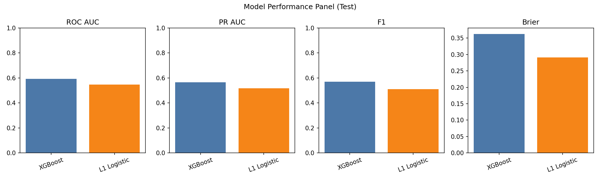
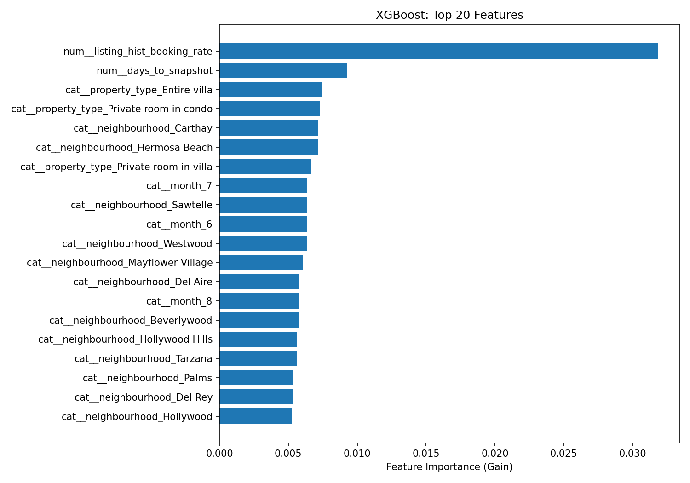

# Airbnb Booking Prediction in Los Angeles

Machine learning project predicting whether a Los Angeles Airbnb listing-night is booked or open using repeated Inside Airbnb snapshots, calendar availability, pricing, weather, holidays, and local event signals.

## Overview

This project asks:

**Can machine learning predict whether a Los Angeles Airbnb listing-night is booked rather than open using a panel built from repeated Inside Airbnb snapshots?**

I built a listing-night panel, engineered time-varying and listing-level features, and compared a regularized logistic model with XGBoost under a strict chronological train/validation/test split.

## What I Did

- Built a listing-night panel from repeated 2025 Airbnb snapshots for Los Angeles
- Created a booking proxy target from calendar availability on actively open nights
- Engineered pricing, amenities, host, geography, seasonality, weather, holiday, and event features
- Used a chronological split to better mimic real forecasting
- Compared L1-logistic regression against XGBoost
- Exported figures, tables, diagnostics, and robustness checks for reporting

## Results

On the held-out test set, XGBoost outperformed the L1-logistic baseline:

| Model | ROC AUC | PR AUC | F1 | Precision | Recall |
| --- | ---: | ---: | ---: | ---: | ---: |
| XGBoost | 0.594 | 0.567 | 0.570 | 0.518 | 0.632 |
| L1 Logistic | 0.548 | 0.518 | 0.510 | 0.495 | 0.525 |

Dataset scale used in the final pipeline:

- Train rows: 525,382
- Validation rows: 305,157
- Test rows: 247,977

Top signals in the XGBoost model included historical booking rate, days to snapshot, neighborhood, property type, seasonality, and price-relative features.

## Visuals

### Model Performance

### XGBoost Feature Importance

## Repository Layout

- `project/airbnb_booking_prediction.ipynb`: end-to-end notebook
- `project/images/figures/`: exported plots
- `project/images/tables/`: exported result tables
- `project/README_submission.md`: original class submission README
- `COURSE_CONTEXT.md`: course and submission context for the original academic project
- `Report_FinalProject_DMM.pdf`: final written report

## Reproducibility

Core packages are listed in `requirements.txt`.

To explore the project, open:

`project/airbnb_booking_prediction.ipynb`

The notebook loads raw data, constructs the curated panel, engineers features, trains models, evaluates predictions, and exports the figures and tables used in the report.

## Note on Data

The original project includes large raw and processed data artifacts. For a cleaner GitHub portfolio version, this repository is configured to exclude large data directories and local cache files from version control.
